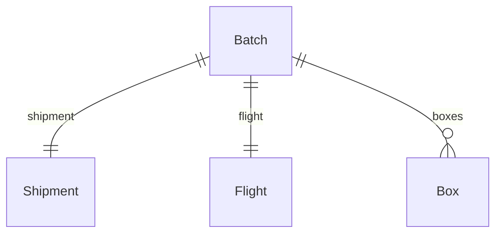

# XML Visual Graph

Transform XML, EDMX, XSD, and OData schemas into beautiful interactive visual graphs.

---

# Overview

XML Visual Graph is a frontend-only web application that allows developers to:

- Paste XML directly
- Upload XML files
- Parse EDMX/OData schemas
- Visualize entities and relationships
- Explore dependencies
- Search entities
- Generate Mermaid diagrams
- Export graph JSON
- Inspect entity properties

The application runs entirely in the browser with no backend.

---

# Target Users

- .NET Developers
- Enterprise Architects
- Database Engineers
- API Engineers
- OData Users
- Solution Architects

---

# Tech Stack

## Core

- Next.js 16+
- React 19
- TypeScript
- TailwindCSS
- shadcn/ui

## Graph Visualization

- React Flow
- Dagre

## XML Processing

- fast-xml-parser

## Code Editors

- Monaco Editor

## State Management

- Zustand

## Utility

- clsx
- tailwind-merge
- zod

---

# Dependencies

```bash
npm install reactflow
npm install dagre

npm install fast-xml-parser

npm install zustand

npm install zod

npm install @monaco-editor/react

npm install lucide-react

npm install sonner

npm install clsx tailwind-merge
```

---

# Project Structure

```txt
src/

├── app/
│   ├── page.tsx
│   ├── layout.tsx
│
├── components/
│   ├── graph/
│   │   ├── graph-canvas.tsx
│   │   ├── entity-node.tsx
│   │   ├── relationship-edge.tsx
│   │
│   ├── editor/
│   │   ├── xml-editor.tsx
│   │
│   ├── sidebar/
│   │   ├── entity-panel.tsx
│   │   ├── search-panel.tsx
│   │
│   ├── toolbar/
│   │   ├── toolbar.tsx
│   │
├── parser/
│   ├── edmx-parser.ts
│   ├── xml-parser.ts
│   ├── graph-builder.ts
│
├── store/
│   ├── graph-store.ts
│
├── types/
│   ├── graph.ts
│   ├── entity.ts
│
├── utils/
│   ├── dagre-layout.ts
│
└── lib/
```

---

# MVP Screens

## 1. Landing Screen

```txt
┌───────────────────────────────────────────┐
│ XML Visual Graph                          │
├───────────────────────────────────────────┤
│                                           │
│ Paste XML Here                            │
│                                           │
│ [ Parse XML ]                             │
│                                           │
└───────────────────────────────────────────┘
```

---

## 2. Graph Workspace

```txt
┌─────────────┬─────────────────────────────┐
│ Entities    │                             │
│             │                             │
│ Batch       │                             │
│ Shipment    │      React Flow Graph       │
│ Flight      │                             │
│ Box         │                             │
│             │                             │
└─────────────┴─────────────────────────────┘
```

---

# Data Models

## Entity

```ts
export interface Entity {
  id: string;
  name: string;
  properties: EntityProperty[];
  relationships: Relationship[];
}
```

## Property

```ts
export interface EntityProperty {
  name: string;
  type: string;
  nullable: boolean;
}
```

## Relationship

```ts
export interface Relationship {
  source: string;
  target: string;
  type: string;
  cardinality: "one" | "many";
}
```

---

# Graph Model

## Node

```ts
export interface GraphNode {
  id: string;
  label: string;
  properties: EntityProperty[];
}
```

## Edge

```ts
export interface GraphEdge {
  id: string;
  source: string;
  target: string;
  label: string;
}
```

---

# EDMX Parsing Strategy

Input:

```xml
<EntityType Name="Batch">

<NavigationProperty
    Name="Shipment"
    Type="Shipment">

</NavigationProperty>

</EntityType>
```

Output:

```ts
{
  name: "Batch",

  relationships: [
    {
      target: "Shipment",
      type: "Shipment",
      cardinality: "one"
    }
  ]
}
```

---

# Supported Relationships

## One To One

```xml
<NavigationProperty
  Name="Shipment"
  Type="Shipment">
```

Result:

```txt
Batch ───── Shipment
```

---

## One To Many

```xml
<NavigationProperty
  Name="Boxes"
  Type="Collection(Box)">
```

Result:

```txt
Batch ─────< Box
```

---

# Parsing Flow

```txt
XML
 ↓
fast-xml-parser
 ↓
JSON
 ↓
Extract EntityType
 ↓
Extract Properties
 ↓
Extract NavigationProperty
 ↓
Build Graph
 ↓
Dagre Layout
 ↓
React Flow
```

---

# Graph Layout

Use Dagre.

```ts
dagre.layout(graph)
```

Benefits:

- Auto positioning
- Prevents overlaps
- Handles hundreds of entities
- Fast

---

# Node Design

```txt
┌─────────────────────┐
│ Batch               │
├─────────────────────┤
│ Id                  │
│ BatchNo             │
│ ShipmentId          │
│ FlightId            │
│ ProductTypeId       │
└─────────────────────┘
```

---

# Entity Inspector

Click a node.

```txt
Batch

Properties

Id
BatchNo
ShipmentId
FlightId

Relationships

Shipment
Flight
Boxes
BatchExports
```

---

# Search

Search entities.

```txt
Search...

Batch
BatchExport
BatchEvent
```

Selecting result:

- Center graph
- Highlight node
- Open inspector

---

# Mermaid Export

Generate automatically.



Copy to clipboard.

---

# JSON Export

```json
{
  "nodes": [],
  "edges": []
}
```

Useful for:

- Debugging
- Future persistence
- Sharing

---

# Future Features

## AI Entity Summaries

Generate explanations for:

- Entity purpose
- Relationships
- Domain meaning

---

## Dependency Explorer

Show:

```txt
Incoming

Shipment
Flight

Outgoing

Boxes
BatchEvents
BatchExports
```

---

## Dark Mode

Using shadcn Theme Provider.

---

## Save Workspace

Future:

- Local Storage
- IndexedDB

No backend required.

---

# Roadmap

## Phase 1

- XML paste
- Parse EDMX
- Build graph
- React Flow
- Search

## Phase 2

- Upload XML
- Mermaid export
- Entity inspector

## Phase 3

- AI summaries
- Multiple file support
- Graph snapshots

## Phase 4

- Team sharing
- Cloud sync
- Schema diffing

---

# Success Criteria

A developer should be able to:

1. Paste a 10,000-line EDMX file.
2. Click Parse.
3. Instantly see all entities.
4. Explore relationships visually.
5. Search any entity.
6. Export Mermaid diagrams.
7. Understand a complex enterprise domain model in minutes instead of hours.
