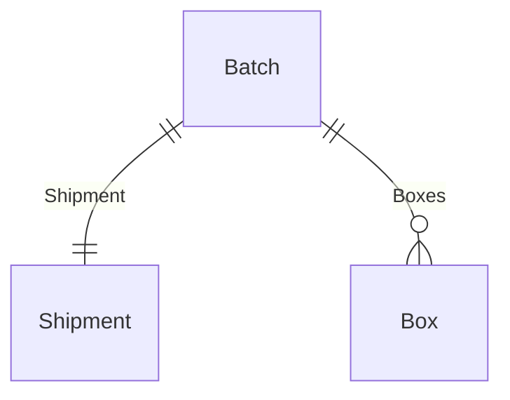

# XML Visual Graph

Transform EDMX / OData $metadata into an interactive entity-relationship graph in the browser.

**Live:** <https://xml.manthaa.dev>

---

## Overview

XML Visual Graph is a client-heavy Next.js app for exploring schema documents. You can:

- Paste an EDMX / OData $metadata document, or upload one or more `.xml` / `.edmx` files
- Merge entities across multiple schemas into a single graph
- Auto-layout entities + navigation properties with Dagre, then drag nodes freely
- Inspect any entity's properties (with PK + type info) and incoming / outgoing relationships
- Generate an AI summary of an entity and its neighbors
- Export the graph as a Mermaid ER diagram or as JSON
- Toggle light / dark mode and LR / TB layout

All parsing, layout, and rendering runs in the browser. The only server-side code is a thin proxy for AI summaries.

---

## Tech stack

- **Next.js 16** (App Router) + **React 19** + **TypeScript**
- **Tailwind v4** with **shadcn/ui** (style `radix-vega`, base color `olive`)
- **@xyflow/react** for the graph canvas, **dagre** for layout
- **fast-xml-parser** for XML
- **Zustand** with `persist` middleware (localStorage) for state
- **next-themes** for dark mode, **sonner** for toasts
- **hugeicons** for iconography, **Google Sans Code** for monospace
- **pnpm** as the package manager

## Server-side surface

There is exactly one server route: `app/api/summarize/route.ts`. It proxies entity context to NVIDIA's `openai/gpt-oss-120b` model so the API key never reaches the browser bundle.

- Requires `NVIDIA_API_KEY` in `.env.local`. Without it the route returns HTTP 503 and the inspector's "Summarize" button surfaces a friendly error.
- Streams the upstream response (SSE) and assembles the final summary server-side to avoid undici's 300s headers timeout on long reasoning runs.

Everything else — parsing, layout, rendering, exports, persistence — runs in the browser.

---

## Getting started

```bash
pnpm install
echo "NVIDIA_API_KEY=..." >> .env.local   # only needed for AI summaries
pnpm dev
```

Scripts:

- `pnpm dev` — Next.js dev server
- `pnpm build` / `pnpm start` — production build
- `pnpm typecheck` — `tsc --noEmit`
- `pnpm lint` — ESLint (`eslint-config-next`)
- `pnpm format` — Prettier with Tailwind class sorting

Add a shadcn primitive: `pnpm dlx shadcn@latest add <name>` — settings in `components.json` must be preserved.

---

## Project layout

The repo uses Next.js's flat default layout (not the `src/` tree). Path alias `@/*` resolves from the repo root.

```txt
app/
├── api/
│   └── summarize/route.ts     # NVIDIA proxy for AI summaries
├── layout.tsx
├── page.tsx                   # editor view ↔ workspace view
├── globals.css
└── icon.svg

components/
├── editor/xml-editor.tsx       # paste / upload + live validation
├── graph/
│   ├── graph-canvas.tsx        # React Flow host + toolbar
│   ├── entity-node.tsx         # collapsible entity card
│   └── relationship-edge.tsx   # crow's-foot edges + markers
├── sidebar/
│   ├── sidebar.tsx             # tabs: Entities | Details
│   ├── search-panel.tsx
│   ├── entity-list.tsx         # grouped by namespace, collapsible
│   ├── entity-inspector.tsx    # compound component
│   ├── entity-inspector-context.tsx
│   └── ai-summary.tsx
├── toolbar/toolbar.tsx
├── theme-provider.tsx
└── ui/                         # shadcn primitives

parser/
├── xml-parser.ts               # fast-xml-parser wrapper
├── edmx-parser.ts              # Schema / EntityType / NavigationProperty walker
├── graph-builder.ts            # Entity[] → ParsedGraph
└── validate.ts                 # used by the editor to pre-validate before parsing

store/
├── graph-store.ts              # Zustand store (persisted)
├── graph-context.ts            # context wrapper for actions/state/meta
├── graph-provider.tsx
└── graph-meta-provider.tsx     # carries the panToNode handle

types/
├── entity.ts                   # Entity, EntityProperty, Relationship
└── graph.ts                    # GraphNode, GraphEdge, ParsedGraph

utils/
├── dagre-layout.ts
├── cardinality.ts              # Collection(X) → many | else one
├── incoming-relationships.ts
└── mermaid.ts                  # ER diagram export

lib/utils.ts                    # cn()
hooks/
public/
```

---

## Data flow

```txt
XML text
   ↓ fast-xml-parser
JS object
   ↓ extractEntities()       (parser/edmx-parser.ts)
Entity[]                      (with namespace, properties, relationships)
   ↓ buildGraph()             (parser/graph-builder.ts)
ParsedGraph { nodes, edges }
   ↓ layoutGraph()            (utils/dagre-layout.ts)
React Flow nodes + edges      (with manual position / z-order overrides)
   ↓
@xyflow/react canvas
```

State lives in a single Zustand store keyed by `xml`, `entities`, `graph`, `selectedEntityId`, `search`, `parseError`, `parsing`, `layoutDirection`, `sidebarTab`, `summaries`, `summaryStatus`, `collapsedNodes`, `nodeZ`, `topZ`, `nodePositions`. The persisted slice (xml + UI state + summaries + manual layout) is rehydrated from localStorage on load and re-parsed.

---

## Data models

```ts
// types/entity.ts
export type Cardinality = "one" | "many";

export interface EntityProperty {
  name: string;
  type: string;        // e.g. "Edm.String", "Edm.Int32"
  nullable: boolean;
  isKey: boolean;
}

export interface Relationship {
  name: string;        // NavigationProperty Name
  target: string;      // referenced EntityType short name
  cardinality: Cardinality;
}

export interface Entity {
  id: string;          // namespace-qualified, used as node id
  name: string;
  namespace?: string;
  properties: EntityProperty[];
  relationships: Relationship[];
}
```

```ts
// types/graph.ts
export interface GraphNode {
  id: string;
  label: string;
  properties: EntityProperty[];
}

export interface GraphEdge {
  id: string;          // `${source}->${target}:${name}`
  source: string;
  target: string;
  label: string;       // navigation property name
  cardinality: "one" | "many";
}

export interface ParsedGraph { nodes: GraphNode[]; edges: GraphEdge[]; }
```

Cardinality is derived from the `NavigationProperty` `Type` attribute: `Collection(X)` → `many`, anything else → `one`. Targets are resolved by **short name** (last `.`-separated segment) — fine for single-schema EDMX, lossy across schemas that share names.

---

## Features

### Editor

- Paste an EDMX document into the textarea, or click **Upload file(s)** to load one or many `.xml` / `.edmx` files.
- Validation runs on a deferred copy of the input so typing stays smooth. Live footer shows file size, line count, character count, and (when valid) entity count.
- The **Parse** button stays disabled until the document validates; errors render below the textarea.
- Multi-file uploads merge entities across schemas, deduping by qualified id.

### Graph canvas

- Entity nodes are draggable, collapsible cards with a PK badge per key property, type names with `Edm.` stripped, and a header that highlights when selected.
- Edges use crow's-foot markers (one vs. many) and a labeled nav-prop name. Paired bidirectional edges have their labels offset so they don't overlap.
- Built-in `Background`, `Controls`, and a `MiniMap` (hidden during drag to avoid jank).
- Manual node positions and z-order are persisted; dagre re-layout is keyed off the source graph + layout direction.

### Sidebar

- Two tabs: **Entities** (search + list grouped by namespace, each collapsible) and **Details** (inspector).
- Clicking an entry selects the entity, switches to the Details tab, and pans the canvas to the node.
- The inspector shows a header, an AI Summary block, properties (with color-coded datatypes), and Outgoing / Incoming relationships with count badges and `one` / `many` cardinality badges.

### AI summaries

- "Summarize" / "Regenerate" button in the inspector calls `/api/summarize` with the selected entity plus its incoming references.
- The server builds a compact prompt (caps verbose property and relationship lists with grouped tails), streams from NVIDIA via SSE, and returns the assembled summary.
- In-flight requests are cancelled when the selection changes, so you don't end up with a stale summary attached to the wrong entity.
- Summaries are persisted per entity id so they survive reloads.

### Exports

- **Copy as Mermaid** — generates an `erDiagram` block with cardinality syntax and copies to clipboard via `navigator.clipboard`.
- **Download JSON** — saves `visual-graph.json` containing the current `ParsedGraph`.
- **Layout direction** toggles between LR (left → right) and TB (top → bottom); dagre re-runs.
- **Reset** clears all state and returns to the editor view.

### Theming

- `next-themes` + the shadcn theme provider. React Flow follows the resolved theme.

---

## EDMX example

Input:

```xml
<EntityType Name="Batch">
  <Key><PropertyRef Name="Id" /></Key>
  <Property Name="Id" Type="Edm.Guid" Nullable="false" />
  <Property Name="BatchNo" Type="Edm.String" />
  <NavigationProperty Name="Shipment" Type="MyNs.Shipment" />
  <NavigationProperty Name="Boxes"    Type="Collection(MyNs.Box)" />
</EntityType>
```

Result:

```txt
Batch ──────  Shipment   (one)
Batch ─────<  Box        (many)
```

Mermaid export:



---

## Roadmap

Done:

- Paste / upload XML or EDMX
- Validate before parse with doc stats
- Multi-file merge across schemas
- Auto-layout + manual drag + persistence
- Collapsible entity nodes, crow's-foot edges, paired-edge label offset
- Search + namespace-grouped entity list
- Inspector with properties, incoming / outgoing relationships
- AI summaries via NVIDIA gpt-oss-120b (streaming, cancellable)
- Mermaid + JSON export, LR / TB layout toggle
- Light / dark mode
- localStorage persistence (xml + UI + summaries + manual layout)

Next:

- Monaco editor (swap the textarea for syntax-highlighted editing on large files)
- Fully-qualified cross-schema reference resolution
- Visualizations for ComplexTypes, EnumTypes, Function / Action imports
- Schema diffing (side-by-side compare of two inputs)
- Graph snapshots / shareable links
- Viewport culling for very large schemas (thousands of entities)

---

## Sources of truth

- `CLAUDE.md` / `AGENTS.md` — repo conventions and the Next.js 16 caveat (training data is stale vs. this version).
- `IMPLEMENTATION_PLAN.md` — phased build plan; treat as the spec when adding a new feature area.
